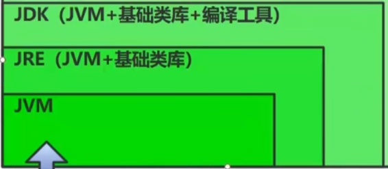
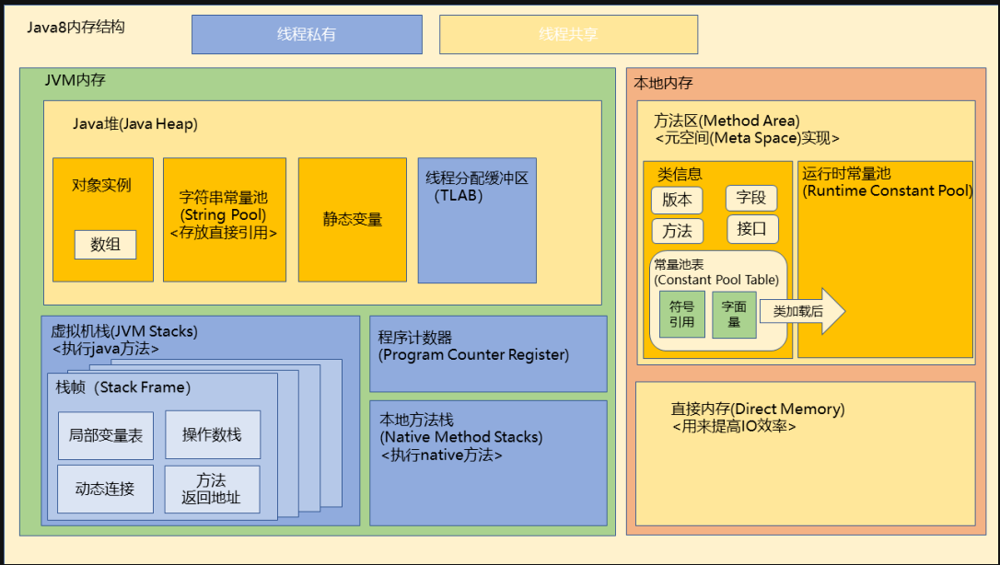
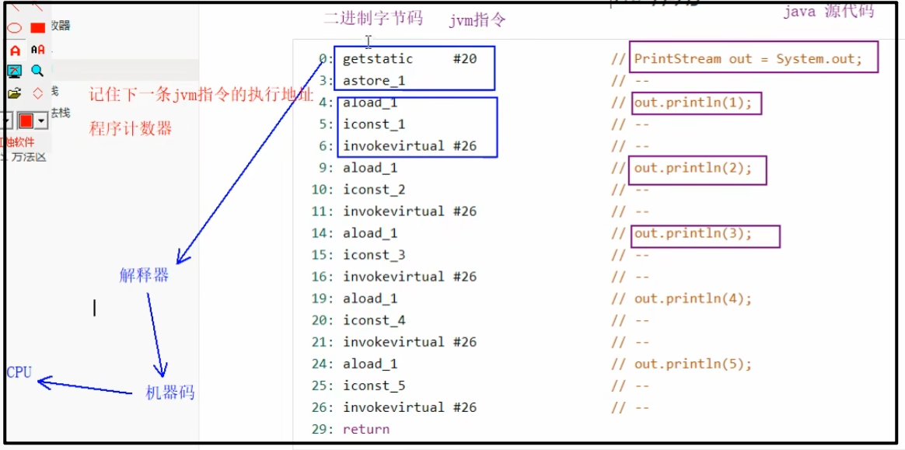
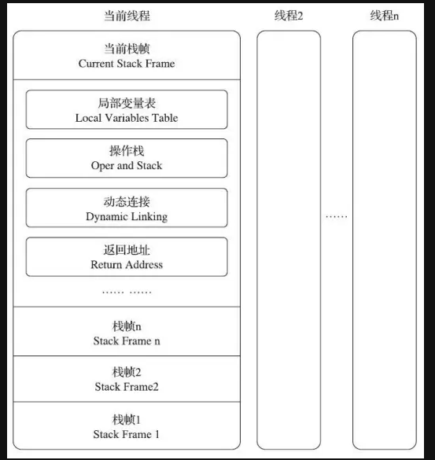
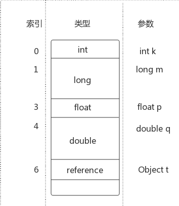
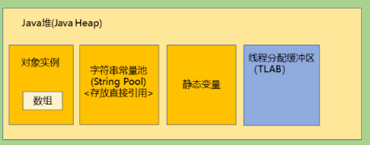
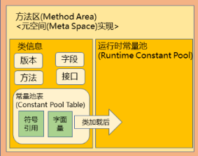
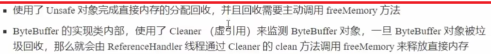
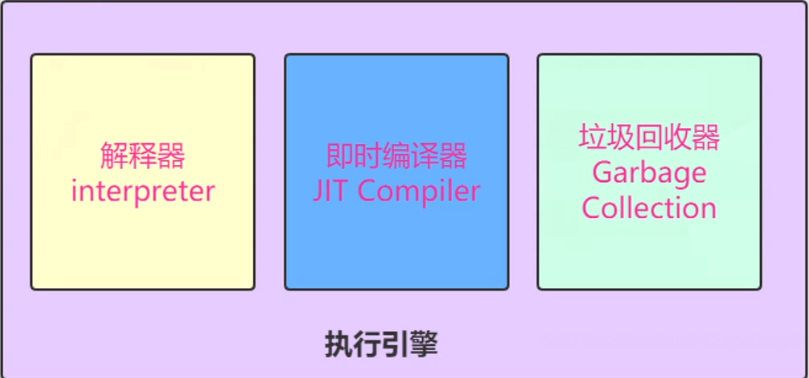

定义: Java Virtual Machine - java程序的运行环境  
好处:  
(1)一次编写,到处运行  
(2)自动内存管理,垃圾回收功能  
(3)数组下标越界检查  
(4)多态的基石

比较: jvm jre jdk



## 2 JVM内存

### 2.1 JVM主要组成部分

JVM包含两个子系统和两个组件，两个子系统为**Class loader(类装载)、 Execution engine(执行引擎)**；两个组件为R**untime data area(运行时数据区)、Native Interface(本地接口)**。  
Class loader(类装载)：根据给定的全限定名类名(如： java.lang.Object)来装载class文件到Runtime data area中的method area。  
Execution engine（执行引擎）：执行classes中的指令。  
Native Interface(本地接口)：与native libraries交互，是其它编程语 言交互的接口。  
Runtime data area(运行时数据区域)：这就是我们常说的JVM的内存

### 2.2 JVM内存(运行时数据区域)



#### 2.2.1 虚拟机内存与本地内存区别

Java虚拟机在执行的时候会把管理的内存分配成不同的区域，这些区域被称为虚拟机内存，同时，对于虚拟机没有直接管理的物理内存，也有一定的利用，这些被利用却不在虚拟机内存数据区的内存，我们称它为本地内存，这两种内存有一定的区别：  
JVM内存受虚拟机内存大小的参数控制，当大小超过参数设置的大小时就会报OOM
本地内存不受虚拟机内存参数限制，只受物理内存容量的限制虽然不受参数的限制，但是如果内存的占用超出物理内存的大小，同样也会报OOM

#### 2.2.3 程序计数器(Program Counter Register)

寄存器。存储着下一条指令的执行地址。用于在上下文切换时进行记录。 由此可见是线程私有的。不存在内存溢出。  
一.java中代码执行流程:
java代码被编译成对应的二进制字节码(jvm指令),然后将jvm指令交给解释器(jvm执行引擎中一个组件),这些jvm令会被解释器解释成为机器码,并交给cpu来处理执行!



二.程序计数器作用:
* 理解:
	每条jvm指令都是有地址的,为了保证程序的执行遵循自上而下有顺序的执行.
	会将指令的内存地址存放到程序计数器中,当执行完当前jvm指令后,解释器会去
	程序计数器中寻找要解释的下一条指令,保证了程序执行的有序性!
* 提炼:
		记住下一条jvm指令的执行地址!从而保证程序执行的有序性!
		多线程环境下,程序计数器也会记住当前线程上次执行结束的位置,当再抢夺到cpu时间片的时候
		会接着上次执行的位置继续执行!!!

在物理上实现程序计数器是通过"**寄存器**"来实现的,"寄存器"是整个cpu组件中读取速度最快的单元
因为读取指令内存地址很频繁,所以java将cpu中的"寄存器"来当做程序计数器来读取指令的内存地址!

三.程序计数器的特点:
* <font color=red>线程私有的(一个线程专属有一个程序计数器)</font>
* <font color=red>唯一一个不会存在内存溢出的内存结构.</font>

#### **2.2.4** 虚拟机栈(JVM Stacks)

Java栈也称作虚拟机栈（Java Vitual Machine Stack），也就是我们常常所说的栈，跟C语言的数据段中的栈类似。事实上，Java栈是Java方法执行的内存模型

​    每当启动给一个线程时，Java虚拟机会为它分配一个Java栈。每个线程只能有一个活动栈帧,对应着正在执行的那个方法!Java栈由许多栈帧组成，一个栈帧包含一个Java方法调用的状态。当线程调用一个Java方法时，虚拟机压入一个新的栈帧到该线程的Java栈中，当该方法返回时，这个栈帧就从Java栈中弹出。Java栈存储线程中Java方法调用的状态–包括局部变量、参数、返回值以及运算的中间结果等。  
​     Java虚拟机没有寄存器，其指令集使用Java栈来存储中间数据。这样设计的原因是为了保持Java虚拟机的指令集尽量紧凑，同时也便于Java虚拟机在只有很少通用寄存器的平台上实现。另外，基于栈的体系结构，也有助于运行时某些虚拟机实现的动态编译器和即时编译器的代码优化。  

Java栈中存放的是一个个的栈帧，每个栈帧对应一个被调用的方法，在栈帧中包括局部变量表(Local Variables)、操作数栈(Operand Stack)、指向当前方法所属的类的运行时常量池的引用(Reference to runtime constant pool)、方法返回地址(Return Address)和一些额外的附加信息。当线程执行一个方法时，就会随之创建一个对应的栈帧，并将建立的栈帧压栈。当方法执行完毕之后，便会将栈帧出栈。因此可知，线程当前执行的方法所对应的栈帧必定位于Java栈的顶部。讲到这里，大家就应该会明白为什么在使用递归方法的时候容易导致栈内存溢出的现象了以及为什么栈区的空间不用程序员去管理了（当然在Java中，程序员基本不用关系到内存分配和释放的事情，因为Java有自己的垃圾回收机制），这部分空间的分配和释放都是由系统自动实施的。对于所有的程序设计语言来说，栈这部分空间对程序员来说是不透明的。下图表示了一个Java栈的模型



Java栈的模型介绍：

局部变量表，以字长为单位(点击此处了解java栈中引用类型结构)、从0开始计数的数组，类型为int, float, reference和returnAddress的值在数组中占据一项，而类型为byte, short和char的值在存入数组前都被转换为int值，也占据一项。但类型为long和double的值在数组中却占据连续的两项。



* <font color=red>局部变量表</font>就是用来存储方法中的局部变量（方法参数和局部变量）。<font color=red>对于基本数据类型的变量，则直接存储它的值，对于引用类型的变量，则存的是指向对象的引用。</font>局部变量表的大小在编译器就可以确定其大小了，因此在程序执行期间局部变量表的大小是不会改变的。
  我们都知道，类属性变量一共要经历两个阶段，分为**准备阶段**和**初始化阶段**，而局部变量是没有准备阶段，只有初始化阶段，而且必须是显示的。如果是非静态方法，则在index[0]位置上存储的是方法所属对象的实例引用，随后存储的是参数和局部变量。字节码指令中的STORE指令就是将操作栈中计算完成的局部变量写回局部变量表的存储空间内

* <font color=red>操作数栈</font>，栈最典型的一个应用就是用来对表达式求值。一个线程执行方法的过程中，实际上就是不断执行语句的过程，而归根到底就是进行计算的过程，然后把结果压回操作数栈，因此可以这么说，程序中的所有计算过程都是在借助于操作数栈来完成的。
  操作栈是一个初始状态为空的桶式结构栈，以字长为单位的数组。在方法执行过程中，会有各种指令往栈中写入和提取信息。**<font color=red>JVM的执行引擎是基于栈的执行引擎</font>**，其中的栈指的就是操作栈。字节码指令集的定义都是基于栈类型的
*  <font color=red>动态连接（指向运行时常量池的引用）</font>，因为在方法执行的过程中有可能需要用到类中的常量，所以必须要有一个引用指向运行时常量。每个栈帧中包含一个在常量池中对当前方法的引用，目的是支持方法调用过程的动态连接
* <font color=red>方法返回地址</font>，当一个方法执行完毕之后，要返回之前调用它的地方，因此在栈帧中必须保存一个方法返回地址。
  方法执行时有两种退出情况：第一，正常退出，即正常执行到任何方法的返回字节码指令，如 RETURN、IRETURN、ARETURN等；第二，异常退出。无论何种退出情况，都将返回方法当前被调用的位置。方法退出的过程相当于弹出当前栈帧，
  退出可能有三种方式：返回值压入上层调用栈帧，异常信息抛给能够处理的栈帧和PC 计数器指向方法调用后的下一条指令

附加信息，由于每个线程正在执行的方法可能不同，因此每个线程都会有一个自己的Java栈，互不干扰

 虚拟机栈特点： 

* 在函数中定义的一些<font color=red>**基本类型的变量**</font>和**<font color=red>对象的引用变量</font>**都在函数的栈内存中分配
* 虚拟机栈是线程私有的，随线程生灭。虚拟机栈描述的是<font color=red>**线程中的方法内存模型**</font>
* 虚拟机栈是当前执行线程独占空间，以栈的数据结构形式存在，方法被执行时入栈，执行完后出栈，特点是：先进后出，后进先出。
* 栈中的数据大小和生命周期是可以确定的，当没有引用指向数据时，这个数据就会消失。当在一段代码块定义一个变量时，Java就在栈中为这个变量分配内存空间，当超过变量的作用域后，Java会自动释放掉为该变量所分配的内存空间，该内存空间可以立即被另作他用
* 虚拟机栈是线程运算执行的区域，它保存着一个线程调用方法的属性和过程
* 每个方法被执行的时候，都会在虚拟机栈中同步创建一个栈帧(stack frame)，以此栈帧的结构压入虚拟机栈
* 每个栈帧的包含如下的内容：局部变量表(局部变量表中存储着方法里的java基本数据类型(byte/boolean/char/int/long/double/float/short)以及对象的引用(这里的基本数据类型指的是方法内的局部变量))操作数栈，动态连接，方法返回地址
* 存储速度比堆快得多，仅次于寄存器，但存在栈中的<font color=red>**数据大小与生存期必须是确定的**</font>，这也导致缺乏了其灵活性，因此栈内存灵活性不如堆内存，数据可以共享


* 方法内的局部变量是否线程安全??
	- 如果方法内局部变量没有逃离方法的作用范围,且是线程私有的,就是线程安全的!
	- 如果局部变量引用了对象,并逃离了方法的作用范围(比如将局部变量返回),需要考虑线程安全

虚拟机栈可能会抛出两种异常：

- 如果线程请求的栈深度大于虚拟机所规定的栈深度，则会抛出**StackOverFlowError即栈溢出**
- 如果虚拟机的栈容量可以动态扩展，那么当虚拟机栈申请不到内存时会抛出OutOfMemoryError即OOM内存溢出 

会产生栈内存溢出的原因:  
(1)栈帧过多  
(2)栈帧过大

#### 2.2.5 本地方法栈(Native Method Stacks)

本地方法栈与虚拟机栈的作用是相似的,都会抛出<font color=red>**OutOfMemoryError**</font>和<font color=red>**StackOverFlowError**</font>，都是线程私有的，主要的区别在于：<font color=red>**虚拟机栈执行的是java方法，本地方法栈执行的是native方法**</font>

本地方法栈用于本地方法（native method：非java语言代码）的调用，作为对 java 虚拟机的重要扩展， java 虚拟机允许 java 直接调用本地方法（通常使用 C 编写）

Java本地接口，也叫 JNI（Java Native Interface），是为可移植性准备的。本地方法接口允许本地方法完成以下工作：

* 传递或返回数据
* 操作实例变量
* 操作类变量或调用类方法
* 操作数组
* 对堆的对象加锁
* 装载新的类
* 抛出异常
* 捕获本地方法调用Java方法抛出的异常
* 捕获虚拟机抛出的异步异常
* 指示垃圾收集器某个对象不再需要

#### 2.2.6 Java堆(Java Heap)



java堆是Java虚拟机**运行时数据区**共享数据区最大的区域，java 堆在虚拟机启动的时候建立，堆的生命周期与JVM进程一致，由所有线程共享,是由垃圾收集器管理的内存区域，**此内存区域的唯一目的就是存放对象实例**，当然由于java虚拟机的发展，堆中也多了许多东西，现在主要有：

* "几乎"所有的对象和数组都在堆中进行分配（对象实例类初始化生成的对象，基本数据类型的数组也是对象实例），特点就是：先进先出，后进后出

* 字符串常量池原本存放于方法区，jdk7开始放置于堆中。字符串常量池存储的是String 对象的直接引用，而不是直接存放的对象，是一张String table

* 静态变量是由static修饰的变量，jdk7时从方法区迁移至堆中

* 线程分配缓冲区(Thread Local Allocation Buffer)线程私有，但是不影响java堆的共性。增加线程分配缓冲区是为了提升对象分配时的效率

* 需要运行时动态分配内存，因此存取速度慢

* 堆中的对象的由垃圾回收器负责回收，因此大小和生命周期不需要确定，具有很大的灵活性

   java堆既可以是固定大小的，也可以是可扩展的(通过参数-Xmx和-Xms设定)，如果堆无法扩展或者无法分配内存时也会报OutOfMemeoryError 

存储速度慢于栈内存，灵活性优于栈内存

#### 2.2.7 方法区(Method Area)




* 方法区的生命周期与JVM进程一致，所有线程共享的内存。存储已被虚拟机加载的<font color=red>**类型信息**</font>，**方法信息**，域信息，<font color=red>**运行时常量池**</font>，<font color=red>**静态变量**</font>，**即时编译器(JIT)编译后的代码**
* 运行时常量池属于Method Area中的一部分
  常量池指的是在编译期被确定，并被保存在已编译的.class文件中的一些数据。除了包含代码中所定义的各种基本类型（如int、long等等）和对象型（如String及数组）的常量值(final)还包含一些以文本形式出现的符号引用，比如：
  类和接口的全限定名；
  字段的名称和描述符；
  方法和名称和描述符

方法区从逻辑上来理解其本身也属于Heap的一部分，但是为了区分和更好的内存对象的垃圾回收，我们将Mehtod Area又称之为Non-Heap，与Heap进行区分理解(JDK8之前的Method Area实现是Perm Space，JDK8及之后的Method Area实现叫Meta Space)
方法区内存不足时，将抛出OOM

方法区与其他区域不同的地方在于，方法区在**编译期间和类加载完成后内容有少许不同**，不过总的来说分为这两部分：

* 类元信息(Klass)：类元信息在类编译期间放入方法区，里面放置了类的基本信息，包括类的版本、字段、方法、接口以及常量池表(Constant Pool Table)常量池表(Constant Pool Table)存储了类在编译期间生成的字面量、符号引用，这些信息在类加载完后会被解析到运行时常量池中
* 运行时常量池(Runtime Constant Pool)：<font color=red>**运行时常量池主要存放在类加载后被解析的字面量与符号引用**</font>，但不止这些运行时常量池具备动态性，可以添加数据，比较多的使用就是String类的intern()方法

字面量和符合引用的理解：

* 字面量：java代码在编译过程中是无法构建引用的，字面量就是在编译时对于数据的一种表示:

```java
  int a=1;//这个1便是字面量 
  String b="iloveu";//iloveu便是字面量 
```

  

* 符号引用：由于在编译过程中并不知道每个类的地址，因为可能这个类还没有加载，所以如果你在一个类中引用了另一个类，那么你完全无法知道他的内存地址，那怎么办，我们只能用他的类名作为符号引用，在类加载完后用这个符号引用去获取他的内存地址。例子：我在com.demo.Solution类中引用了com.test.Quest，那么我会把com.test.Quest作为符号引用存到类常量池，等类加载完后，拿着这个引用去方法区找这个类的内存地址
  Java之所以是符号引用而不是像c语言那样，编译时直接指定其他类型，是因为**java是动态绑定**的，只有在运行时根据某些规则才能确定具体依赖的类型实例，这正是**java实现多态的基础**

在java8以前是放在JVM内存中的，由永久代实现，受JVM内存大小参数的限制，在java8中移除了永久代的内容，方法区由元空间(Meta Space)实现，并直接放到了本地内存中，不受JVM参数的限制，**并且将原来放在方法区的字符串常量池和静态变量都转移到了Java堆中** 

#### 2.2.8 直接内存(Direct Memory)

jdk1.4中加入了NIO(New Input/Putput)类，引入了一种基于**通道(channel)与缓冲区(buffer)**的新IO方式，它可以使用native函数直接分配堆外内存，然后通过存储在java堆中的DirectByteBuffer对象作为这块内存的引用进行操作，这样可以在一些场景下大大提高IO性能，避免了在java堆和native堆来回复制数据

java 的 NIO 库允许 java 程序使用直接内存。<font color=red>**直接内存是在 java 堆外的、直接向系统申请的内存空间**</font>。通常访问直接内存的速度会优于 java 堆。因此出于性能的考虑，读写频繁的场合可能会考虑使用直接内存。由于直接内存在 java 堆外，因此它的大小不会直接受限于 Xmx （虚拟机参数）指定的最大堆大小，但是系统内存是有限的， java 堆和直接内存的总和依然受限于操作系统能给出的最大内存。<font color=red>**直接内存位于本地内存，不属于JVM内存，不受GC管理，但是也会在物理内存耗尽的时候报OOM**</font>。

注意：direct buffer不受GC影响，但是direct buffer归属的JAVA对象是在堆上且能够被GC回收的，一旦它被回收，JVM将释放direct buffer的堆外空间

直接内存的释放是通过一个unsafe对象来管理的.无法通过垃圾回收来释放!
一般这个对象都是在jdk内部自己使用!不是使用垃圾回收!

ByteBuffer内部调用了unsafe对象的直接内存的分配的方法,
java中释放直接内存使用了"虚引用"的机制!



#### 2.2.9 执行引擎



执行引擎是 java 虚拟机的最核心组件之一，它负责执行虚拟机的字节码，有**即时编译和解释执行**，通常采用解释执行方式。解释执行是指解释器通过每次解释并执行一小段代码来完成.class程序的所有操作。即时编译则是将.class文件翻译成机器码在执行（比如：经常多次访问的代码可以全部编译）

作为运行时实例的执行引擎就是一个线程。**运行中Java程序的每一个线程都是一个独立的虚拟机执行引擎的实例**。从线程生命周期的开始到结束，它要么在执行字节码，要么执行本地方法。

执行引擎是JVM执行Java字节码的核心，执行方式主要分为解释执行、编译执行、自适应优化执行、硬件芯片执行方式。**JVM的指令集是基于栈而非寄存器的**，这样做的好处在于可以使指令尽可能紧凑，便于快速地在网络上传输（别忘了Java最初就是为网络设计的），同时也很容易适应通用寄存器较少的平台，并且有利于代码优化，由于Java栈和PC寄存器是线程私有的，线程之间无法互相干涉彼此的栈。每个线程拥有独立的JVM执行引擎实例。


JVM指令由单字节操作码和若干操作数组成。对于需要操作数的指令，通常是先把操作数压入操作数栈，即使是对局部变量赋值，也会先入栈再赋值。

1. 解释执行
   和一些动态语言类似，JVM可以解释执行字节码
   解释执行中有几种优化方式：
   a.栈顶缓存
   将位于操作数栈顶的值直接缓存在寄存器上，对于大部分只需要一个操作数的指令而言，就无需再入栈，可以直接在寄存器上进行计算，结果压入操作数站。这样便减少了寄存器和内存的交换开销。
   b.部分栈帧共享
   被调用方法可将调用方法栈帧中的操作数栈作为自己的局部变量区，这样在获取方法参数时减少了复制参数的开销。
   c.执行机器指令
   在一些特殊情况下，JVM会执行机器指令以提高速度。

2.编译执行
   为了提升执行速度，Sun JDK提供了将字节码编译为机器指令的支持，主要利用了JIT（Just-In-Time）编译器在运行时进行编译，它会在第一次执行时编译字节码为机器码并缓存，之后就可以重复利用
3.自适应优化执行
   自适应优化执行的思想是程序中10%~20%的代码占据了80%~90%的执行时间，所以通过将那少部分代码编译为优化过的机器码就可以大大提升执行效率。自适应优化的典型代表是Sun的Hotspot VM，正如其名，JVM会监测代码的执行情况，当判断特定方法是瓶颈或热点时，将会启动一个后台线程，把该方法的字节码编译为极度优化的、静态链接的C++代码。当方法不再是热区时，则会取消编译过的代码，重新进行解释执行。
   自适应优化不仅通过利用小部分的编译时间获得大部分的效率提升，而且由于在执行过程中时刻监测，对内联代码等优化也起到了很大的作用。由于面向对象的多态性，一个方法可能对应了很多种不同实现，自适应优化就可以通过监测只内联那些用到的代码，大大减少了内联函数的大小