## 3 堆结构及对象分代

整个堆的大小 = 年轻代大小 + 年老代大小，**堆的大小不包含元空间大小**，如果增大了年轻代，年老代相应就会减小，官方默认的配置为年老代大小/年轻代大小=2/1 左右

### 3.1 分代，分代的必要性

堆内存是虚拟机管理的内存中最大的一块，也是垃圾回收最频繁的一块区域，我们程序所有的对象实例都存放在堆内存中。**给堆内存分代是为了提高对象内存分配和垃圾回收的效率**。

试想一下，如果堆内存没有区域划分，所有的新创建的对象和生命周期很长的对象放在一起，随着程序的执行，堆内存需要频繁进行垃圾收集，而每次回收都要遍历所有的对象，遍历这些对象所花费的时间代价是巨大的，会严重影响我们的 GC 效率。

有了内存分代，情况就不同了，新创建的对象会在新生代中分配内存，经过多次回收仍然存活下来的对象存放在老年代中， 静态属性、类信息等存放在永久代中，**新生代中的对象存活时间短，只需要在新生代区域中频繁进行 GC**，老年代中对象生命周期长，内存回收的频率相对较低，不需要频繁进行回收，永久代中回收效果太差，一般不进行垃圾回收，还可以根据不同年代的特点采用合适的垃圾收集算法。分代收集大大提升了收集效率，这些都是内存分代带来的好处。

### 3.2 分代的划分

Java 虚拟机将堆内存划分为新生代、老年代和永久代，永久代是 HotSpot 虚拟机特有的概念（JDK1.8 之后为 metaspace 元空间替代永久代），它采用永久代的方式来实现方法区，其他的虚拟机实现没有这一概念，而且 HotSpot 也有取消永久代的趋势，在 JDK 1.7 中 HotSpot 已经开始了“去永久化”，把原本放在永久代的字符串常量池移出。永久代主要存放常量、类信息、静态变量等数据，与垃圾回收关系不大，新生代和老年代是垃圾回收的主要区域。

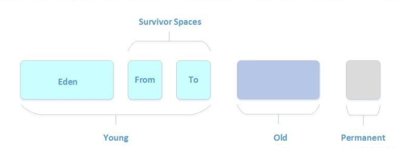

新生成的对象优先存放在新生代中，新生代对象朝生夕死，存活率很低，在新生代中，常规应用进行一次垃圾收集一般可以回收 **70% ~ 95%** 的空间，回收效率很高。

HotSpot 将新生代划分为三块，一块较大的 Eden（伊甸） 空间和两块较小的 Survivor（幸存者） 空间，默认比例为 8： 1： 1。划分的目的是因为 HotSpot 采用复制算法来回收新生代，设置这个比例是为了充分利用内存空间，减少浪费。新生成的对象在 Eden 区分配（大对象除外，大对象直接进入老年代），当 Eden 区没有足够的空间进行分配时，虚拟机将发起一次Minor GC。

GC 开始时，**对象只会存在于 Eden 区和 From Survivor 区**， To Survivor 区是空的（作为保留区域）。 GC 进行时， Eden 区中所有存活的对象都会被复制到 To Survivor 区，而在 FromSurvivor 区中，仍存活的对象会根据它们的年龄值决定去向，年龄值达到年龄阀值（默认为15，新生代中的对象每熬过一轮垃圾回收，年龄值就加 1， GC 分代年龄存储在对象的 header中）的对象会被移到老年代中，没有达到阀值的对象会被复制到 To Survivor 区。

接着清空Eden 区和 From Survivor 区，新生代中存活的对象都在 To Survivor 区。接着， From Survivor区和 To Survivor 区会交换它们的角色，也就是新的 To Survivor 区就是上次 GC 清空的 FromSurvivor 区，新的 From Survivor 区就是上次 GC 的 To Survivor 区，**总之，不管怎样都会保证To Survivor 区在一轮 GC 后是空的**。 GC 时当 To Survivor 区没有足够的空间存放上一次新生代收集下来的存活对象时，需要依赖老年代进行分配担保，将这些对象存放在老年代中。

Minor GC会一直重复这样的过程，直到“To”区被填满即Eden区存活的对象和from区存活的对象很多了，被复制到to区域时，to区域一下子接收装不下了，则“To”区被填满时，就不会再进行角色互换变成from了，而是“To”区被填满之后，会将所有对象移动到年老代中，则“To”区是空的了，即“To”区变成空有两种方式，一是对象从from移动到to区后，角色互换，为空的区域from变成to，to就变成空了的；二是Eden和from中未达到15岁的对象两者加起来太多，移动到to区填满了，则把填满了to区的对象移动到老年代，此时eden区和from区对象变少了，to区也没经过角色互换，变成空的

注意：假如说S0区或者S1区空间对象复制移动了之后还是放不下，那就说明这时候是真的满了，那就去老年区借点空间过来（这就是担保机制，老年代需要提供这种空间分配担保），假如说老年区空间也不够了，那就会触发Full GC，如果还是不够，那就会抛出OutOfMemeoyError异常了

### 3.3 对象生命周期和名词解释

* 垃圾回收：简称GC。
* Minor GC：针对新生代的GC
* Major GC：针对老年代的GC，一般老年代触发GC的同时也会触发Minor GC，也就等于触发了Full GC。
* Full GC：新生代+老年代同时发生GC。
* Young区：新生代
* Old区：老年代
* Eden区：暂时没发现有什么中文翻译(伊甸园?)
* Surcivor区：幸存区
* S0和S1：也称之为from区和to区，注意from和to两个区是不断互换身份的，且S0和S1一定要相等，并且保证一块区域是空的

一个对象的人生轨迹图

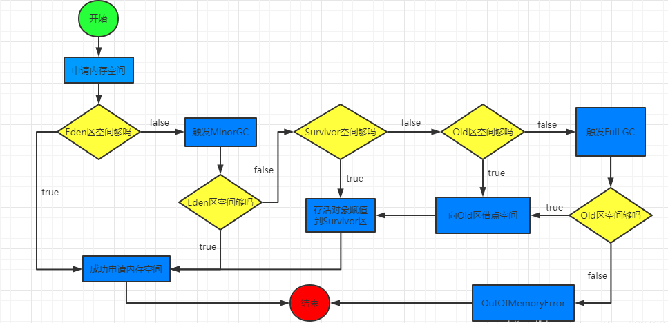

## 4 垃圾回收

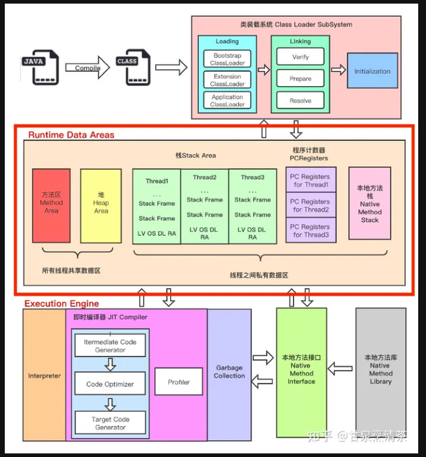

查看当前服务器用的垃圾回收器：

```shell
java -XX:+PrintCommandLineFlags -version
```

### 4.1 怎么定义垃圾？

#### 4.1.1**引用计数法**

给对象添加一个引用计数器，当对象增加一个引用时计数器加 1，引用失效时计数器减 1。引用计数为 0 的对象可被回收。两个对象出现循环引用的情况下，此时引用计数器永远不为 0，导致无法对它们进行回收。正因为循环引用的存在，因此 Java 虚拟机不使用引用计数算法。

#### 4.1.2****可达性分析算法****

这个算法的基本思想是通过一系列称为“GC Roots”的对象作为起始点，从这些节点向下搜索，搜索所走过的路径称为引用链，当一个对象到GC Roots没有任何引用链（即GC Roots到对象不可达）时，则证明此对象是不可用的

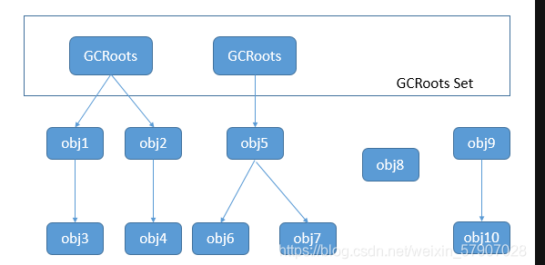

可作为GC Roots的对象：

* 虚拟栈中引用的对象
* 方法区中类静态属性引用的对象
* 方法区中常量引用的对象
* 本地方法栈中JNI引用的对象
* JVM内部的引用
* 所有被同步锁(Synchronized关键字)持有的对象
* 反应Java虚拟机内部情况的JMXBean、JVMTI中注册的回调、本地代码缓存等

要经历两次标记,第一次标记: 是否在GC Root的引用链上,是否可达.在对象被判断为不可达之后不会立即回收,还会有第二次标记.会将第一次标记的需要回收的对象放入一个名称为F-Queue中,然后让一个优先级较低的线程来调用队列中要回收对象的finalize()方法.

第二次标记(对象的自救!): 只有未被调用过finalize()方法和重写了finalize()方法的对象才会会调用该方法.
否则第二次标记的时候还是会存在与F-Queue队列中.

自救的方法:
		在调用该对象的finalize()方法时,在重写的该方法中将对象赋值给某个变量,如把this关键字赋值给其他变量,这样在第二次标记的时候就会发现
		该对象是存在与引用链上,会从要回收的名单中剔除.就完成了自救!	

```java
public class SelfRescueExample {

    private static SelfRescueExample savedInstance = null;

    @Override
    protected void finalize() throws Throwable {
        super.finalize();
        System.out.println("Finalizing object...");
        savedInstance = this; // 在 finalize() 方法中将对象引用赋值给静态变量 savedInstance
    }

    public static void main(String[] args) {
        SelfRescueExample obj1 = new SelfRescueExample();

        // 让 obj1 成为垃圾对象
        obj1 = null;

        // 手动触发垃圾回收
        System.gc();

        try {
            // 等待一段时间，让 finalize() 方法执行
            Thread.sleep(1000);
        } catch (InterruptedException e) {
            e.printStackTrace();
        }

        if (savedInstance != null) {
            System.out.println("Object self-rescued successfully!");
        } else {
            System.out.println("Object not self-rescued.");
        }
    }
}
```

在 finalize() 方法中，对象有最后的机会执行一些清理工作，比如释放资源、关闭连接等操作，以避免对象被回收前遗留一些问题。

#### 4.1.3四种引用状态

1、强引用

代码中普遍存在的类似"Object obj = new Object()"这类的引用，**只要强引用还存在，垃圾收集器永远不会回收掉被引用的对象。**

2、软引用

**描述有些还有用但并非必需的对象。在系统将要发生内存溢出异常之前，将会把这些对象列进回收范围进行二次回收**。如果这次回收还没有足够的内存，才会抛出内存溢出异常。Java中的类SoftReference表示软引用。

比如很多图片资源,如果使用强引用引用这些图片资源,则会容易发生内存溢出.
改进: 在内存紧张时,将该占有的内存释放掉,以后要使用到时,再读取一遍!
	要采用软/弱引用!

```java
public static void soft() {
    // list --> SoftReference --> byte[]

    List<SoftReference<byte[]>> list = new ArrayList<>();
    for (int i = 0; i < 5; i++) {
        SoftReference<byte[]> ref = new SoftReference<>(new byte[_4MB]);
        System.out.println(ref.get());
        list.add(ref);
        System.out.println(list.size());

    }
    System.out.println("循环结束：" + list.size());
    for (SoftReference<byte[]> ref : list) {
        System.out.println(ref.get());
    }
}
```

软引用引用的对象在内存紧张时被回收,我们也希望将软引用对象本身也回收掉!
软引用对象本身也是占用内存的!
如何清理一个无用的软引用对象本身呢??

- 需要使用[引用队列]来完成软引用的清理!

  ```java
  public class Demo2_4 {
      private static final int _4MB = 4 * 1024 * 1024;
  
      public static void main(String[] args) {
          List<SoftReference<byte[]>> list = new ArrayList<>();
  
          // 引用队列
          ReferenceQueue<byte[]> queue = new ReferenceQueue<>();
  
          for (int i = 0; i < 5; i++) {
              // 关联了引用队列， 当软引用所关联的 byte[]被回收时，软引用自己会加入到 queue 中去
              SoftReference<byte[]> ref = new SoftReference<>(new byte[_4MB], queue);
              System.out.println(ref.get());
              list.add(ref);
              System.out.println(list.size());
          }
  
          // 从队列中获取无用的 软引用对象，并移除
          Reference<? extends byte[]> poll = queue.poll();
          while( poll != null) {
              list.remove(poll);
              poll = queue.poll();
          }
  
          System.out.println("===========================");
          for (SoftReference<byte[]> reference : list) {
              System.out.println(reference.get());
          }
  
      }
  }
  ```

3、弱引用

**描述非必需对象。被弱引用关联的对象只能生存到下一次垃圾回收之前，垃圾收集器工作之后，无论当前内存是否足够，都会回收掉只被弱引用关联的对象**。Java中的类WeakReference表示弱引用。

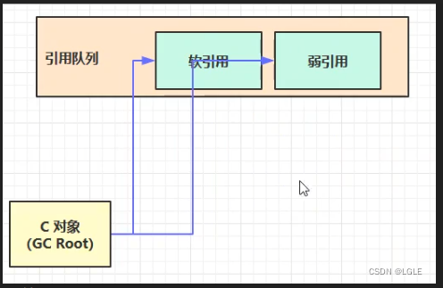

4、虚引用

**这个引用存在的唯一目的就是在这个对象被收集器回收时收到一个系统通知，被虚引用关联的对象，和其生存时间完全没关系**。Java中的类PhantomReference表示虚引用。必须配合引用队列使用，主要配合ByteBuffer使用引，被引用对象回收时，会将虚引用入队，由Reference Handler线程调用虚引用Unsafe.freeMemory方法释放直接内存。

它通常用于跟踪对象被垃圾回收器回收的状态。虚引用并不会影响对象的生命周期，它的主要作用是允许程序员在对象被回收时执行一些特定的操作。

虚引用在实际应用中有一些常见的用途，包括：

1. 跟踪对象被回收：通过虚引用，程序员可以在对象被垃圾回收器回收时得到通知。这对于一些需要在对象被回收时执行清理或资源释放操作的场景很有用。
2. 构建清理型资源管理器：虚引用可以用于构建清理型资源管理器，用于管理一些需要在对象被回收时进行清理操作的资源，比如文件句柄、网络连接等。
3. 监控对象的回收状态：虚引用可以用于监控对象的回收状态，比如在调试或性能分析工具中，可以利用虚引用来监控对象的回收情况。

需要注意的是，虚引用并不直接与对象的生命周期相关联，它通常需要与引用队列（ReferenceQueue）一起使用，通过引用队列来接收对象被回收的通知。在实际应用中，虚引用通常需要结合引用队列来发挥作用。

#### 4.1.4方法区的垃圾回收

方法区的垃圾回收主要回收两部分内容：1. 废弃常量。2. 无用的类。既然进行垃圾回收，就需要判断哪些是废弃常量，哪些是无用的类。

如何判断废弃常量呢？以字面量回收为例，如果一个字符串“abc”已经进入常量池，但是当前系统没有任何一个String对象引用了叫做“abc”的字面量，那么，如果发生垃圾回收并且有必要时，“abc”就会被系统移出常量池。常量池中的其他类（接口）、方法、字段的符号引用也与此类似。

如何判断无用的类呢？需要满足以下三个条件

1. 该类的所有实例都已经被回收，即Java堆中不存在该类的任何实例。
2. 加载该类的ClassLoader已经被回收。
3. 该类对应的java.lang.Class对象没有在任何地方被引用，无法在任何地方通过反射访问该类的方法。

满足以上三个条件的类可以进行垃圾回收，但是并不是无用就被回收，虚拟机提供了一些参数供我们配置。

### 4.2垃圾回收算法

#### 4.2.1标记-清除(Mark-Sweep)

这是最基础的算法，标记-清除算法就如同它的名字样，分为“标记”和“清除”两个阶段：首先标记出所有需要回收的对象，标记完成后统一回收所有被标记的对象。这种算法的不足主要体现在效率和空间，从效率的角度讲，标记和清除两个过程的效率都不高；从空间的角度讲，标记清除后会产生大量不连续的内存碎片， 内存碎片太多可能会导致以后程序运行过程中在需要分配较大对象时，无法找到足够的连续内存而不得不提前触发一次垃圾收集动作。标记-清除算法执行过程如图：

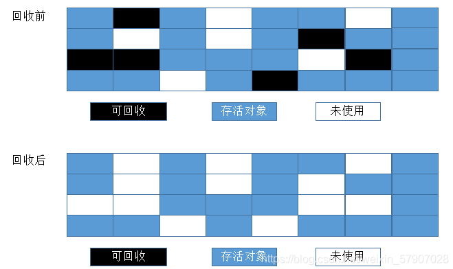

#### 4.2.2复制（Copying）算法

复制算法是为了解决效率问题而出现的，它将可用的内存分为两块，每次只用其中一块，当这一块内存用完了，就将还存活着的对象复制到另外一块上面，然后再把已经使用过的内存空间一次性清理掉。这样每次只需要对整个半区进行内存回收，内存分配时也不需要考虑内存碎片等复杂情况，只需要移动指针，按照顺序分配即可。复制算法的执行过程如图：

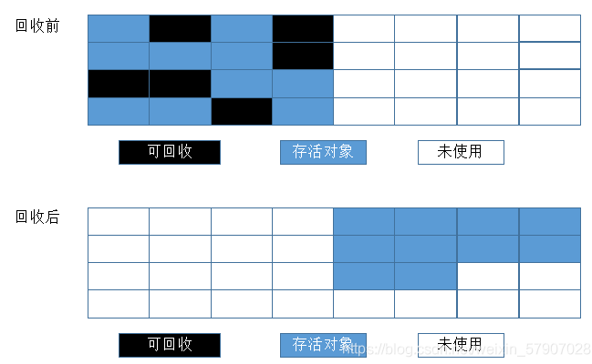

不过这种算法有个缺点，内存缩小为了原来的一半，这样代价太高了。现在的商用虚拟机都采用这种算法来回收新生代，不过研究表明1:1的比例非常不科学，因此新生代的内存被划分为一块较大的Eden空间和两块较小的Survivor空间，每次使用Eden和其中一块Survivor。每次回收时，将Eden和Survivor中还存活着的对象一次性复制到另外一块Survivor空间上，最后清理掉Eden和刚才用过的Survivor空间。HotSpot虚拟机默认Eden区和Survivor区的比例为8:1，意思是每次新生代中可用内存空间为整个新生代容量的90%。当然，我们没有办法保证每次回收都只有不多于10%的对象存活，当Survivor空间不够用时，需要依赖老年代进行分配担保（Handle Promotion）。

#### 4.2.3标记-整理（Mark-Compact）算法

复制算法在对象存活率较高的场景下要进行大量的复制操作，效率很低。万一对象100%存活，那么需要有额外的空间进行分配担保。老年代都是不易被回收的对象，对象存活率高，因此一般不能直接选用复制算法。根据老年代的特点，有人提出了另外一种标记-整理算法，过程与标记-清除算法一样，不过不是直接对可回收对象进行清理，而是让所有存活对象都向一端移动，然后**直接清理掉边界以外的内存**。标记-整理算法的工作过程如图：

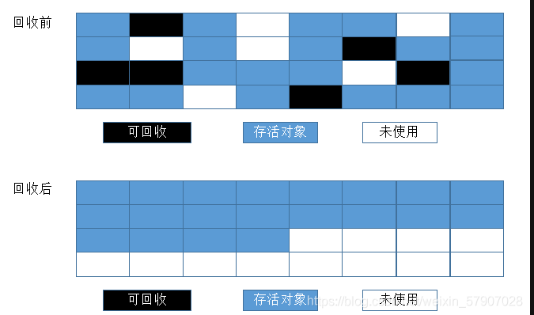

#### 4.2.4 分代收集算法

现代商用虚拟机基本都采用分代收集算法来进行垃圾回收。这种算法没什么特别的，无非是上面内容的结合罢了，根据对象的生命周期的不同将内存划分为几块，然后根据各块的特点采用最适当的收集算法。大批对象死去、少量对象存活的（新生代），使用复制算法，复制成本低；对象存活率高、没有额外空间进行分配担保的（老年代），采用标记-清理算法或者标记-整理算法。

**分代垃圾回收的话如何记录新生代与老年代的引用关系呢**，如果全部扫描老年代非常消耗时间，由此引入了卡表。

在新生代建立一个全局的数据结构(Remembered Set 记忆集),用于记录新生代和老年代之间存在跨代引用的关系
避免了minor GC时需要对老年代全扫描一遍的低效!

记忆集(Remembered Set)是一种抽象的数据结构,记录了发生跨代引用之间的关系.而从新生代确认到对应的老年代的粒度,可以存在"卡精度",具体就是可以定位到老年代中哪一块内存区域,也就是被称为卡表技术!采用卡表的方式实现了记忆集!

**那么何时进行卡表的更新呢？**

1.HotSpot中通过"写屏障"的技术维护了卡表的更新状态!
1.概述:
写屏障可以看作在虚拟机层面对“引用类型字段赋值”这个动作的AOP切
面,在引用对象赋值时会产生一个环绕（Around）通知，供程序执行额外的动作，也就是说赋值的
前后都在写屏障的覆盖范畴内。

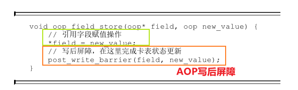

卡表技术：

将老年代的区域再进行细分,分成很多个card.
如果当前某个card引用了新生代中的某对象,则这个card被称为脏card
这样就是减少搜索范围,只需要关注"脏card"就好..提高扫描根对象的效率。

被引用的新生代的区域会有一个Remembered Set,会记录从外部对我的一些引用.也就是记录都有哪些脏card
将来对新生代做垃圾回收的时候,就可以根据"新生代"知道它对应的哪些脏card

在引用变更的时候都更新脏card.是一个异步操作,不会立即更新,会将脏卡的指令放到一个dirty card队列之中,
将来由一个线程完成脏card的更新操作!!!

### 4.3 垃圾收集器

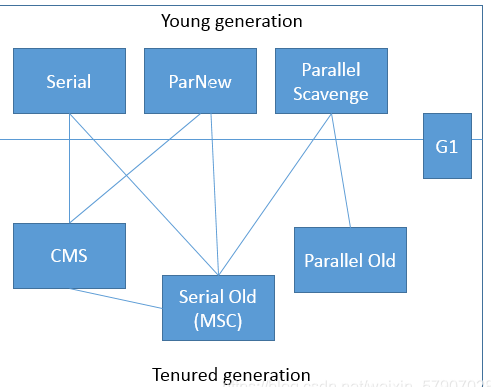

上图展示了7种作用于不同分代的收集器，如果两个收集器之间存在连线，那说明它们可以搭配使用。虚拟机所处的区域说明它是属于新生代收集器还是老年代收集器。多说一句，我们必须明确一个观点：没有最好的垃圾收集器，更加没有万能的收集器，只能选择对具体应用最合适的收集器。这也是HotSpot为什么要实现这么多收集器的原因。OK，下面一个一个看一下收集器。

#### 4.3.1 Serial收集器

最基本、发展历史最久的收集器，这个收集器是一个采用**复制算法**的单线程的收集器，单线程一方面意味着它只会使用一个CPU或一条线程去完成垃圾收集工作，另一方面也意味着它进行垃圾收集时必须暂停其他线程的所有工作，直到它收集结束为止。后者意味着，在用户不可见的情况下要把用户正常工作的线程全部停掉，这对很多应用是难以接受的。不过实际上到目前为止，Serial收集器依然是虚拟机运行在Client模式下的默认新生代收集器，因为它简单而高效。用户桌面应用场景中，分配给[虚拟机管理](https://so.csdn.net/so/search?q=虚拟机管理&spm=1001.2101.3001.7020)的内存一般来说不会很大，收集几十兆甚至一两百兆的新生代停顿时间在几十毫秒最多一百毫秒，只要不是频繁发生，这点停顿是完全可以接受的。Serial收集器运行过程如下图所示：

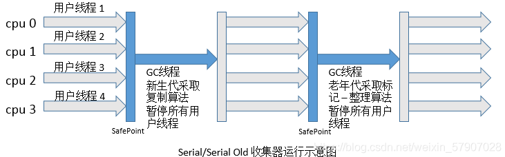

**说明：1. 需要STW（Stop The World），停顿时间长。2. 简单高效，对于单个CPU环境而言，Serial收集器由于没有线程交互开销，可以获取最高的单线程收集效率。**

#### 4.3.2 ParNew收集器

ParNew收集器其实就是Serial收集器的多线程版本，**除了使用多条线程进行垃圾收集外，其余行为和Serial收集器完全一样，包括使用的也是复制算法**。ParNew收集器除了多线程以外和Serial收集器并没有太多创新的地方，但是它却是**Server模式下的虚拟机首选的新生代收集器**，其中有一个很重要的和性能无关的原因是，**除了Serial收集器外，目前只有它能与CMS收集器配合工作（看图）**。CMS收集器是一款几乎可以认为有划时代意义的垃圾收集器，因为它第一次实现了让垃圾收集线程与用户线程基本上同时工作。ParNew收集器在单CPU的环境中绝对不会有比Serial收集器更好的效果，甚至由于线程交互的开销，该收集器在两个CPU的环境中都不能百分之百保证可以超越Serial收集器。当然，随着可用CPU数量的增加，它对于GC时系统资源的有效利用还是很有好处的。它默认开启的收集线程数与CPU数量相同，在CPU数量非常多的情况下，可以使用-XX:ParallelGCThreads参数来限制垃圾收集的线程数。ParNew收集器运行过程如下图所示：

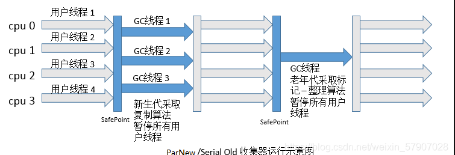

#### 4.3.3 Parallel Scavenge收集器

**Parallel Scavenge收集器也是一个新生代收集器，也是用复制算法的收集器，也是并行的多线程收集器**，但是它的特点是它的关注点和其他收集器不同。介绍这个收集器主要还是介绍吞吐量的概念。**CMS等收集器的关注点是尽可能缩短垃圾收集时用户线程的停顿时间，而Parallel Scavenge收集器的目标则是打到一个可控制的吞吐量**。所谓吞吐量的意思就是CPU用于运行用户代码时间与CPU总消耗时间的比值，即吞吐量=运行用户代码时间/（运行用户代码时间+垃圾收集时间），虚拟机总运行100分钟，垃圾收集1分钟，那吞吐量就是99%。另外，**Parallel Scavenge收集器是虚拟机运行在Server模式下的默认垃圾收集器。**

停顿时间短适合需要与用户交互的程序，良好的响应速度能提升用户体验；高吞吐量则可以高效率利用CPU时间，尽快完成运算任务，主要适合在后台运算而不需要太多交互的任务。

虚拟机提供了-XX:MaxGCPauseMillis和-XX:GCTimeRatio两个参数来精确控制最大垃圾收集停顿时间和吞吐量大小。不过不要以为前者越小越好，GC停顿时间的缩短是以牺牲吞吐量和新生代空间换取的。由于与吞吐量关系密切，**Parallel Scavenge收集器也被称为“吞吐量优先收集器”**。Parallel Scavenge收集器有一个-XX:+UseAdaptiveSizePolicy参数，这是一个开关参数，这个参数打开之后，就不需要手动指定新生代大小、Eden区和Survivor参数等细节参数了，虚拟机会根据当前系统的运行情况手机性能监控信息，动态调整这些参数以提供最合适的停顿时间或者最大的吞吐量。**如果对于垃圾收集器运作原理不太了解，以至于在优化比较困难的时候，使用Parallel Scavenge收集器配合自适应调节策略，把内存管理的调优任务交给虚拟机去完成将是一个不错的选择。**

#### 4.3.4 Serial Old收集器

**Serial收集器的老年代版本，同样是一个单线 程收集器，使用“标记-整理算法”**，这个收集器的主要意义也是在于给Client模式下的虚拟机使用。

#### 4.3.5.Parallel Old收集器

**Parallel Scavenge收集器的老年代版本，使用多线程和“标记-整理”算法**。这个收集器在JDK 1.6之后的出现，“吞吐量优先收集器”终于有了比较名副其实的应用组合，在注重吞吐量以及CPU资源敏感的场合，都可以优先考虑Parallel Scavenge收集器+Parallel Old收集器的组合。运行过程如下图所示：

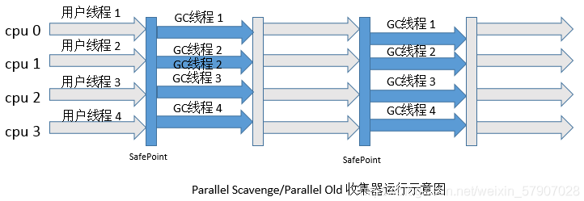

#### 4.3.6 CMS收集器

CMS（Conrrurent Mark Sweep）收集器是**以获取最短回收停顿时间**为目标的收集器。只能用于老年代的回收。使用标记 - 清除算法，收集过程分为如下四步：

(1). 初始标记，标记GCRoots能直接关联到的对象，时间很短。

(2). 并发标记，进行GCRoots Tracing（可达性分析）过程，时间很长。

(3). 重新标记，修正并发标记期间因用户程序继续运作而导致标记产生变动的那一部分对象的标记记录，时间较长。

(4). 并发清除，回收内存空间，时间很长。

其中，并发标记与并发清除两个阶段耗时最长，但是可以与用户线程并发执行。运行过程如下图所示:

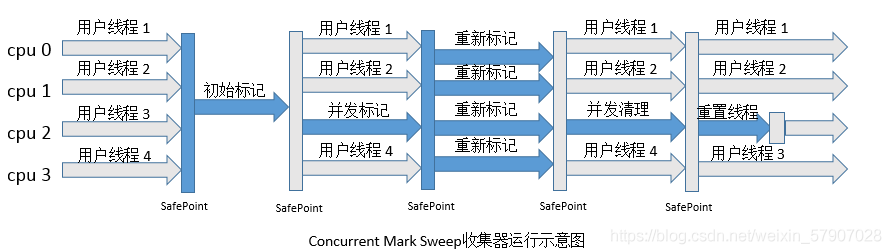

说明：  

1. 对CPU资源非常敏感，可能会导致应用程序变慢，吞吐率下降。并发阶段，耗时较长，总吞吐量会降低。

2. 无法处理浮动垃圾， 因为在并发清理阶段用户线程还在运行，自然就会产生新的垃圾，而在此次收集中无法收集他们，只能留到下次收集，这部分垃圾为浮动垃圾，同时，由于用户线程并发执行，所以需要预留一部分老年代空间提供并发收集时程序运行使用。

3. 由于采用的**标记 - 清除算法**，会产生**大量的内存碎片**，不利于大对象的分配，可能会提前触发一次Full GC。虚拟机提供了-XX:+UseCMSCompactAtFullCollection参数来进行碎片的合并整理过程，这样会使得停顿时间变长，虚拟机还提供了一个参数配置，-XX:+CMSFullGCsBeforeCompaction，用于设置执行多少次不压缩的Full GC后，接着来一次带压缩的GC。解决: 让CMS进行一定次数的Full GC的后进行一次标记整理的算法,控制住内存碎片的数量.可以通过参数配置...	

```shell
   -XX:+UseCMSCompactAtFullCollection
```

   

5. 浮动垃圾:
   在gc线程与用户线程并发进行的阶段,gc线程在"并发标记"阶段,在搜集垃圾,但是在此时阶段用户线程的操作导致的原先通过"初始标记"的"非垃圾对象"变为"垃圾对象",而此时gc收集器无法检测到,则该垃圾对象被称为"浮动垃圾".

6. 错标:
    在"初始标记"的垃圾对象,在"并发标记"阶段因为用户线程的影响变为了非垃圾对象.此时称为错标!

注意:  
(1)浮动垃圾无所谓,在下次垃圾回收的时候会把该垃圾回收.不会有什么特别的影响.但是"错标"的线程,会导致要使用的对象被回收了.就会造成影响.所以接下来的"重新标记"阶段就是解决"错标"的问题!!!  
(2)"初始标记"和"重新标记"都会产生极其短暂的STW.但可忽略不计!  
(3)当CMS并发处理失败的时候,会立马切换Serial Old来清理!  
(4) CMS解决错标问题采用了"增量更新"的方式.对于那些黑色增加对白色的引用,会通过写屏障的技术记录下来,再重新标记阶段进行以黑色为根重新扫描一遍,来解决错标的问题!


**CMS并发失败的问题?**
在第四阶段并发清理阶段CMS不会STW,依旧gc线程和用户线程一起运行.并不能像别的老年代垃圾回收器那样等待垃圾快满了
再回收, 而是在并发清理阶段预留一定的空间给程序运行.当无法为程序分配足够的空间时,则并发失败,冻结用户线程,然后
换为Serial Old来清理.

##### 三色标记算法


#### 4.3. 7 G1收集器

G1是目前技术发展的最前沿成果之一，HotSpot开发团队赋予它的使命是未来可以替换掉JDK1.5中发布的CMS收集器。与其他GC收集器相比，G1收集器有以下特点：

(1). 并行和并发。使用多个CPU来缩短Stop The World停顿时间，与用户线程并发执行。

(2). 分代收集。独立管理整个堆，但是能够采用不同的方式去处理新创建对象和已经存活了一段时间、熬过多次GC的旧对象，以获取更好的收集效果。

(3). 空间整合。基于**标记 - 整理算法**，无内存碎片产生。

(4). 可预测的停顿。能简历可预测的停顿时间模型，能让使用者明确指定在一个长度为M毫秒的时间片段内，消耗在垃圾收集上的时间不得超过N毫秒。

在G1之前的垃圾收集器，收集的范围都是整个新生代或者老年代，而G1不再是这样。使用G1收集器时，Java堆的内存布局与其他收集器有很大差别，它将整个Java堆**划分为多个大小相等的独立区域**（Region），虽然还保留有新生代和老年代的概念，但新生代和老年代不再是物理隔离的了，它们都是一部分（可以不连续）Region的集合。

## 5、理解GC日志

每种收集器的日志形式都是由它们自身的实现所决定的，换言之，每种收集器的日志格式都可以不一样。不过虚拟机为了方便用户阅读，将各个收集器的日志都维持了一定的共性，来看下面的一段GC日志：

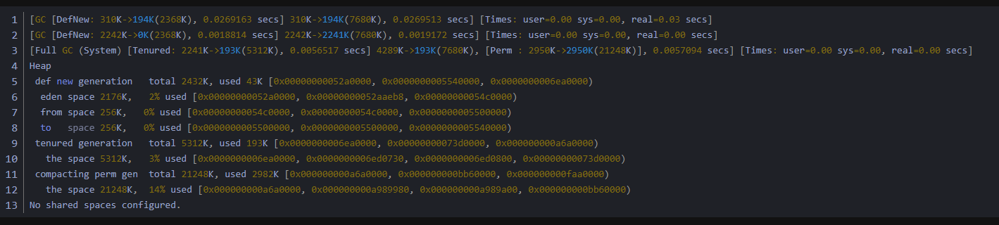

1、日志的开头“GC”、“Full GC”**表示这次垃圾收集的停顿类型**，而不是用来区分新生代GC还是老年代GC的。如果有Full，则说明本次GC停止了其他所有工作线程(Stop-The-World)。看到Full GC的写法是“Full GC(System)”，这说明是调用System.gc()方法所触发的GC。

2、“GC”中接下来的“[DefNew”**表示GC发生的区域**，这里显示的区域名称与使用的GC收集器是密切相关的，例如上面样例所使用的Serial收集器中的新生代名为“Default New Generation”，所以显示的是“[DefNew”。如果是ParNew收集器，新生代名称就会变为“[ParNew”，意为“Parallel New Generation”。如果采用Parallel Scavenge收集器，那它配套的新生代称为“PSYoungGen”，老年代和永久代同理，名称也是由收集器决定的。

3、后面方括号内部的“310K->194K(2368K)”、“2242K->0K(2368K)”，指的是**该区域已使用的容量->GC后该内存区域已使用的容量(该内存区总容量)**。方括号外面的“310K->194K(7680K)”、“2242K->2241K(7680K)”则指的是GC前Java堆已使用的容量->GC后Java堆已使用的容量(Java堆总容量)。

4、再往后“0.0269163 secs”表示**该内存区域GC所占用的时间**，单位是秒。最后的“[Times: user=0.00 sys=0.00 real=0.03 secs]”则更具体了，user表示用户态消耗的CPU时间、内核态消耗的CPU时间、操作从开始到结束经过的墙钟时间。后面两个的区别是，墙钟时间包括各种非运算的等待消耗，比如等待磁盘I/O、等待线程阻塞，而CPU时间不包括这些耗时，但当系统有多CPU或者多核的话，多线程操作会叠加这些CPU时间，所以如果看到user或sys时间超过real时间是完全正常的。

5、“Heap”后面就列举出堆内存目前各个年代的区域的内存情况。

## 6. JVM一次完整的GC流程

1）新创建的对象会被分配在新生代中。

* 新生代按照8：1：1将新生代划分成Eden区、两个Survivor区。
* 当Eden满之后，Minor GC就触发了。

  


2）在Minor GC前，JVM先比较新生代中对象和老年代剩余空间的大小：

* 如果老年代剩余空间 > 新生代中对象的大小：直接GC。
* 如果老年代剩余空间 < 新生代中对象的大小：就要看“老年代空间分配担保规则”：
* 老年代剩余空间 > 历次MinorGC后剩余对象的大小，进行Minor GC；
* 老年代剩余空间 < 历次MinorGC后剩余对象的大小，进行Full GC，把老年代空出来再检查。
           

3）开启老年代空间担保分配规则只能说是大概率上来说，Minor GC剩余的对象能够放到老年代，但也有可能出现意外：

Minor GC之后的对象：

足够放到Survivor区，GC结束；
不够放到Survivor区，接着进入老年代，
如果老年代能放下，GC结束。
老年代放不下，只能触发Full GC。
4）3种OOM：

Full GC之后，老年代仍然放不下剩余对象；
未开启老年代分配担保机制，且第一次Full GC后，老年代仍放不下剩余对象；
开启老年代分配担保，但是担保不通过，一次Full GC后，老年代仍放不下剩余对象。

### 6.1 触发GC之后，会立刻进行GC吗？

不会。

虚拟机为“会长时间执行”的程序设置了安全点，这就决定了用户程序执行时并非在代码指令流的任意位置都能够停顿下来开始垃圾收集，而是强制要求必须执行到达安全点之后才能够暂停。

如何在垃圾回收时让所有线程都跑到最近的安全点然后停顿下来？

**抢占式中断**（几乎不会用）
**主动式中断**：而主动式中断的思想是当垃圾收集需要中断线程的时候，不直接对线程操作，仅仅简单地设置一个标志位，各个线程执行过程时会不停地主动去轮询这个标志，一旦发现中断标志为真时就自己在最近的安全点上主动中断挂起。轮询标志的地方和安全点是重合的，另外还要加上所有创建对象和其他需要在Java堆上分配内存的地方，这是为了检查是否即将要发生垃圾收集，避免没有足够内存分配新对象。

但是这种情况下，程序“不执行”的时候呢？

所谓的程序不执行就是没有分配处理器时间，典型的场景便是用户线程处于Sleep状态或者Blocked状态，这时候线程无法响应虚拟机的中断请求，不能再走到安全的地方去中断挂起自己，虚拟机也显然不可能持续等待线程重新被激活分配处理器时间。

安全区域是指能够确保在某一段代码片段之中，引用关系不会发生变化，因此，在这个区域中任意地方开始垃圾收集都是安全的。我们也可以把安全区域看作被扩展拉伸了的安全点。

当用户线程执行到安全区域里面的代码时，首先会标识自己已经进入了安全区域，那样当这段时间里虚拟机要发起垃圾收集时就不必去管这些已声明自己在安全区域内的线程了。当线程要离开安全区域时，它要检查虚拟机是否已经完成了根节点枚举（或者垃圾收集过程中其他需要暂停用户线程的阶段），如果完成了，那线程就当作没事发生过，继续执行；否则它就必须一直等待，直到收到可以离开安全区域的信号为止。

### **Full GC会导致什么？**

会“Stop The World”，即在GC期间全程暂停用户的应用程序。 Minor GC 会引起 Stop-The-World（STW）事件。时间比Full GC短。

### **什么时候触发GC，如何减少Full GC的次数？**

触发GC

* 新生代的Eden区的空间耗尽时，触发Minor GC

* Minor GC前，老年代内存剩余 < 年轻代晋升老年代的对象大小，触发Full GC；

* PS：在CMS等并发收集器中，每隔一段时间检查一下老年代内存的使用量，超过一定比例则进行Full GC回收。  

**减少Full GC次数的措施**

  1. **优化内存分配和使用**：
     - 减少对象的创建和销毁次数，尽可能重用对象，避免过度的对象创建。
     - 避免使用过多的临时对象，例如在循环中创建大量的临时对象。
     - 使用对象池（Object Pool）来缓存和复用对象，特别是对于频繁创建和销毁的对象。
  2. **调整堆内存大小**：
     - 通过调整堆内存的大小，使得堆能够更好地适应应用程序的内存需求。如果堆内存过小，可能会导致频繁的 Full GC 操作；而如果堆内存过大，则会增加垃圾回收的时间。
     - 监控应用程序的内存使用情况，并根据实际情况调整堆内存大小。
  3. **选择合适的垃圾回收器**：
     - 根据应用程序的特性和性能需求选择合适的垃圾回收器。不同的垃圾回收器对 Full GC 的触发条件和执行方式可能有所不同。
     - 如果**应用程序的吞吐量需求较高**，可以考虑使用并行垃圾回收器（Parallel GC）或者 G1 垃圾回收器（Garbage-First GC）。
     - 如果**应用程序对响应时间要求较高**，并且不希望出现长时间的停顿，可以考虑使用 CMS 垃圾回收器（Concurrent Mark-Sweep GC）。
  4. **避免内存泄漏**：
     - 定期检查和分析应用程序的内存使用情况，及时发现并修复内存泄漏问题。
     - 使用内存分析工具（如 Eclipse Memory Analyzer）来帮助识别和解决内存泄漏问题。
  5. **优化应用程序代码**：
     - 避免在代码中使用 finalize() 方法，因为 finalize() 方法的执行可能会导致 Full GC 的触发。
     - 优化代码中的循环和递归，避免出现过深的递归调用或者过长的循环。

  通过以上方法，可以有效地减少 Full GC 的次数，提高应用程序的性能和稳定性。

##   总结

**垃圾回收器的分类**
根据线程的数量来分：

单线程（串行）垃圾回收器 ：Serial、Serial Old；

多线程（并行）垃圾回收器：Parnew、Parallel Scavenge、Parallel Old。

根据工作内存来分：

**新生代垃圾回收器**：Serial、Parnew、Parallel Scavenge；

**老年代垃圾回收器**：Serial Old、Parallel Old、CMS。

根据工作模式分：

独占式垃圾回收器：Serial、Parnew、Parallel Scavenge；

并发式垃圾回收器：CMS、G1。

GC性能指标
STW时间 : （“Stop The World”）垃圾回收时暂停用户线程的时间。

吞吐量 : 用户线程运行时间/(用户线程运行时间+垃圾回收时间)。

垃圾收集开销：吞吐量的补数，垃圾回收时间/用户线程运行时间+垃圾回收时间。

内存占用：Java堆区多占用的内存大小。

快速：一个对象从诞生到被回收的时间。

GC性能指标主要看**吞吐量和STW停顿时间**。并且吞吐量和STW停顿时间是相互矛盾的，只能折中考虑。

各个垃圾回收器的特点也不一样，有的追求吞吐量，有的追求STW停顿时间。一般在不同的场合采用不同的垃圾回收器。比如与**用户交互较多的场景中追求低延迟**，因此要求STW时间较少;而**后台程序就比较追求吞吐量**。


从G1收集器的设计，我们可以看到现代垃圾收集器的发展趋势是追求处理应用的内存分配速度(Allocation Rate)，而不是一次性清理整个Java堆。这种设计允许应用程序在分配内存的同时，收集器也在进行垃圾收集。只要收集速度能跟上对象分配速度，系统就能高效运行。这种新设计思路自G1收集器开始流行，标志着垃圾收集器技术的一个里程碑。

**Java 8 ：**

总体来说，哪款收集器更好，往往需要针对具体场景进行定量比较。根据实践经验，小内存应用上CMS可能表现更好，而大内存应用上G1能发挥优势。这个优劣势的Java堆容量平衡点通常在6GB至8GB之间，不过也需根据实际情况进行测试，以得出最合适的结论。

## 

### 不同垃圾回收器适合回收的内存大小：

1、Serial 几十兆
2、Parallel 上百兆至几个G
3、CMS 几十G
4、G1 上百G
5、ZGC T级别 (JDK13)