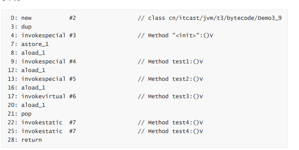
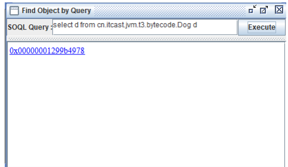
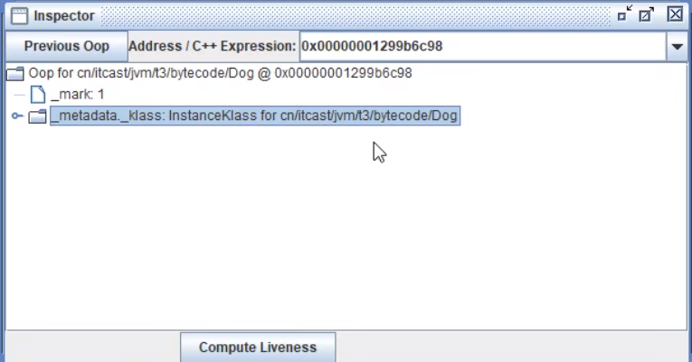
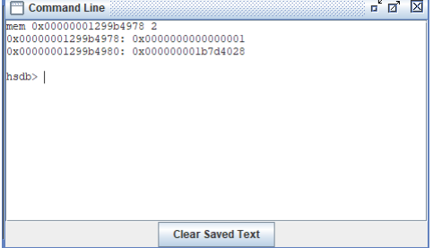
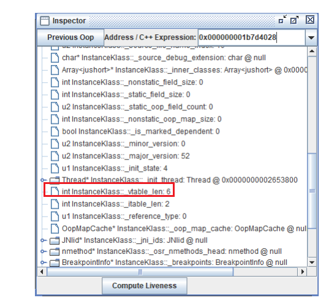
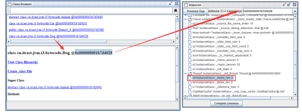
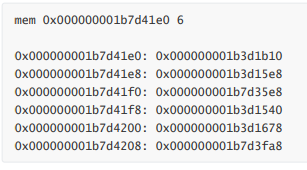

#### 方法调用

```java
public class Demo3_9 {
    public Demo3_9() { }

    private void test1() { }

    private final void test2() { }

    public void test3() { }

    public static void test4() { }

    @Override
    public String toString() {
        return super.toString();
    }

    public static void main(String[] args) {
        Demo3_9 d = new Demo3_9();
        d.test1();
        d.test2();
        d.test3();
        d.test4();
        Demo3_9.test4();
        d.toString();
    }

}
```

字节码



* new 是创建【对象】，给对象分配堆内存，执行成功会将【对象引用】压入操作数栈
*  dup 是复制操作数栈栈顶的内容，本例即为【对象引用】，为什么需要两份引用呢，一个是要配 合 invokespecial 调用该对象的构造方法 "":()V （会消耗掉栈顶一个引用），另一个要 配合 astore_1 赋值给局部变量
* 最终方法（final），私有方法（private），构造方法都是由 invokespecial 指令来调用，属于静 态绑定
* 普通成员方法是由 invokevirtual 调用，属于动态绑定，即支持多态。需要查找多次才能确定方法的入口地址。
* 还有一个执行 invokespecial 的情况是通过 super 调用父类方法
* 成员方法与静态方法调用的另一个区别是，执行方法前是否需要【对象引用】 比较有意思的是 d.test4(); 是通过【对象引用】调用一个静态方法，可以看到在调用 invokestatic 之前执行了 pop 指令，把【对象引用】从操作数栈弹掉了😂 （静态方法的调用不需要对象）还有一个执行 invokespecial 的情况是通过 super 调用父类方法

#### 多态的原理

```java
public class Demo3_10 {

    public static void test(Animal animal) {
        animal.eat();
        System.out.println(animal.toString());
    }

    public static void main(String[] args) throws IOException {
        test(new Cat());
        test(new Dog());
        System.in.read();
    }
}

abstract class Animal {
    public abstract void eat();

    @Override
    public String toString() {
        return "我是" + this.getClass().getSimpleName();
    }
}

class Dog extends Animal {

    @Override
    public void eat() {
        System.out.println("啃骨头");
    }
}

class Cat extends Animal {

    @Override
    public void eat() {
        System.out.println("吃鱼");
    }
}
```

1）运行代码 停在 System.in.read() 方法上，这时运行 jps 获取进程 id   
2）运行 HSDB 工具 进入 JDK 安装目录，执行

```shell
java -cp ./lib/sa-jdi.jar sun.jvm.hotspot.HSDB
```

进入图形界面 attach 进程 id

3）查找某个对象 打开 Tools -> Find Object By Query 输入 select d from cn.itcast.jvm.t3.bytecode.Dog d 点击 Execute 执行。找到该对象的内存地址。



4）查看对象内存结构

点击超链接可以看到对象的内存结构，此对象没有任何属性，因此只有对象头的 16 字节，前 8 字节是 MarkWord，后 8 字节就是对象的 Class 指针 但目前看不到它的实际地址



5）查看对象 Class 的内存地址

可以通过 Windows -> Console 进入命令行模式，执行

```
mem 0x00000001299b4978 2
```

mem 有两个参数，参数 1 是对象地址，参数 2 是查看 2 行（即 16 字节） 结果中第二行 0x000000001b7d4028 即为 Class 的内存地址



6）查看类的 vtable

方法1：Alt+R 进入 Inspector 工具，输入刚才的 Class 内存地址，看到如下界面



或者 Tools -> Class Browser 输入 Dog 查找，可以得到相同的结果



无论通过哪种方法，都可以找到 Dog Class 的 vtable 长度为 6，意思就是 Dog 类有 6 个虚方法（多态 相关的，final，static 不会列入） 那么这 6 个方法都是谁呢？从 Class 的起始地址开始算，偏移 0x1b8 就是 vtable 的起始地址，进行计 算得到

```
0x000000001b7d4028 
				1b8 + 
--------------------- 
0x000000001b7d41e0
```

通过 Windows -> Console 进入命令行模式，执行



就得到了 6 个虚方法的入口地址

```
Dog - public void eat() @0x000000001b7d3fa8 
Animal - public java.lang.String toString() @0x000000001b7d35e8; 
Object - protected void finalize() @0x000000001b3d1b10; 
Object - public boolean equals(java.lang.Object) @0x000000001b3d15e8; 
Object - public native int hashCode() @0x000000001b3d1540; 
Object - protected native java.lang.Object clone() @0x000000001b3d1678;
```

对号入座，发现 eat() 方法是 Dog 类自己的 toString() 方法是继承 String 类的 finalize() ，equals()，hashCode()，clone() 都是继承 Object 类的

8）小结 当执行 invokevirtual 指令时，

1. 先通过栈帧中的对象引用找到对象 
2. 分析对象头，找到对象的实际 Class 
3.  Class 结构中有 vtable，它在类加载的链接阶段就已经根据方法的重写规则生成好了 
4. 查表得到方法的具体地址
5.  执行方法的字节码