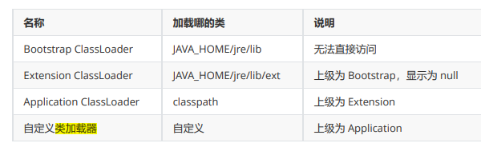
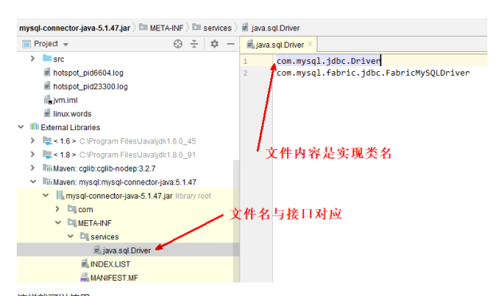

### 类加载器



#### 5.1 启动类加载器

用 Bootstrap 类加载器加载类：

```java
public class F {
    static {
        System.out.println("bootstrap F init");
    }
}
```

```java
public class Load5_1 {
    public static void main(String[] args) throws ClassNotFoundException {
        Class<?> aClass = Class.forName("cn.itcast.jvm.t3.load.F");
        System.out.println(aClass.getClassLoader()); // AppClassLoader  ExtClassLoader
    }
}
```

输出

```
E:\git\jvm\out\production\jvm>java -Xbootclasspath/a:. 
cn.itcast.jvm.t3.load.Load5 
bootstrap F init 
null
```

3.启动类加载器 java代码无法直接获得,获得到的是null.因为这个加载器是由c++写的..

#### 5.2扩展类加载器

当你想让扩展类加载器加载一个类的时候,把该类达成jar包,然后放到Java_HOME/jre/lib/ext目录下...
然后扩展类加载器就会加载这个目录下的jar包类...就轮不到应用类加载器来加载了....

### 5.3 双亲委派模式

所谓的双亲委派，就是指调用类加载器的 loadClass 方法时，查找类的规则

 注意 这里的双亲，翻译为上级似乎更为合适，因为它们并没有继承关系

```java
protected Class<?> loadClass(String name, boolean resolve)
    throws ClassNotFoundException
{
    synchronized (getClassLoadingLock(name)) {
        // First, check if the class has already been loaded / 1. 检查该类是否已经加载
        Class<?> c = findLoadedClass(name);
        if (c == null) {
            long t0 = System.nanoTime();
            try {
                // 2. 有上级的话，委派上级 loadClass
                if (parent != null) {
                    c = parent.loadClass(name, false);
                } else {
                    // 3. 如果没有上级了（ExtClassLoader），则委派BootstrapClassLoader
                    c = findBootstrapClassOrNull(name);//调用的本地方法C++实现的
                }
            } catch (ClassNotFoundException e) {
                // ClassNotFoundException thrown if class not found
                // from the non-null parent class loader
            }

            if (c == null) {
                // If still not found, then invoke findClass in order
                // to find the class.
                // 4. 每一层找不到，调用 findClass 方法（每个类加载器自己扩展）来加载
                long t1 = System.nanoTime();
                c = findClass(name);

                // this is the defining class loader; record the stats
                sun.misc.PerfCounter.getParentDelegationTime().addTime(t1 - t0);
                sun.misc.PerfCounter.getFindClassTime().addElapsedTimeFrom(t1);
                sun.misc.PerfCounter.getFindClasses().increment();
            }
        }
        if (resolve) {
            resolveClass(c);
        }
        return c;
    }
}
```

执行流程为： 

1. sun.misc.Launcher$AppClassLoader //1 处， 开始查看已加载的类，结果没有 
2. sun.misc.Launcher$AppClassLoader // 2 处，委派上级 sun.misc.Launcher$ExtClassLoader.loadClass()
3. sun.misc.Launcher$ExtClassLoader // 1 处，查看已加载的类，结果没有
4.  sun.misc.Launcher$ExtClassLoader // 3 处，没有上级了，则委派 BootstrapClassLoader 查找 
5.  BootstrapClassLoader 是在 JAVA_HOME/jre/lib 下找 H 这个类，显然没有
6.  sun.misc.Launcher$ExtClassLoader // 4 处，调用自己的 findClass 方法，是在 JAVA_HOME/jre/lib/ext 下找 H 这个类，显然没有，回到 sun.misc.Launcher$AppClassLoader 的 // 2 处 
7. 继续执行到 sun.misc.Launcher$AppClassLoader // 4 处，调用它自己的 findClass 方法，在 classpath 下查找，找到了

### 5.4 线程上下文类加载器

我们在使用 JDBC 时，都需要加载 Driver 驱动，不知道你注意到没有，不写

```
Class.forName("com.mysql.jdbc.Driver")
```

也是可以让 com.mysql.jdbc.Driver 正确加载的，你知道是怎么做的吗？ 让我们追踪一下源码：

```java
public class DriverManager {


    // List of registered JDBC drivers  注册驱动的集合
    private final static CopyOnWriteArrayList<DriverInfo> registeredDrivers = new CopyOnWriteArrayList<>();
    // 初始化驱动
      static {
        loadInitialDrivers();
        println("JDBC DriverManager initialized");
    }
    }
```

DriverManager的类加载器为是 Bootstrap ClassLoader，会到 JAVA_HOME/jre/lib 下搜索类，但  JAVA_HOME/jre/lib 下显然没有 mysql-connector-java-5.1.47.jar 包，这样问题来了，在 DriverManager 的静态代码块中，怎么能正确加载 com.mysql.jdbc.Driver 呢？

```java
private static void loadInitialDrivers() {
    String drivers;
    try {
        drivers = AccessController.doPrivileged(new PrivilegedAction<String>() {
            public String run() {
                return System.getProperty("jdbc.drivers");
            }
        });
    } catch (Exception ex) {
        drivers = null;
    }
    // If the driver is packaged as a Service Provider, load it.
    // Get all the drivers through the classloader
    // exposed as a java.sql.Driver.class service.
    // ServiceLoader.load() replaces the sun.misc.Providers()
	// 1）使用 ServiceLoader 机制加载驱动，即 SPI
		AccessController.doPrivileged(new PrivilegedAction<Void>() {
        public Void run() {
			//底层也是通过获取线程上下文类加载器，来完成对驱动类的加载..底层也是调用了class.forName()
            ServiceLoader<Driver> loadedDrivers = ServiceLoader.load(Driver.class);
            Iterator<Driver> driversIterator = loadedDrivers.iterator();

       
            try{
                while(driversIterator.hasNext()) {
                    driversIterator.next();
                }
            } catch(Throwable t) {
            // Do nothing
            }
            return null;
        }
    });

    println("DriverManager.initialize: jdbc.drivers = " + drivers);
	// 2）使用 jdbc.drivers 定义的驱动名加载驱动
    if (drivers == null || drivers.equals("")) {
        return;
    }
    String[] driversList = drivers.split(":");
    println("number of Drivers:" + driversList.length);
    for (String aDriver : driversList) {
        try {
            println("DriverManager.Initialize: loading " + aDriver);
            // 这里的 ClassLoader.getSystemClassLoader() 就是应用程序类加载器
            Class.forName(aDriver, true,
                    ClassLoader.getSystemClassLoader());
        } catch (Exception ex) {
            println("DriverManager.Initialize: load failed: " + ex);
        }
    }
}
```

先看 2）发现它最后是使用 Class.forName 完成类的加载和初始化，关联的是应用程序类加载器，因此 可以顺利完成类加载。

再看 1）它就是大名鼎鼎的 Service Provider Interface （SPI）

约定如下，在 jar 包的 META-INF/services 包下，以接口全限定名名为文件，文件内容是实现类名称



```java
ServiceLoader<接口类型> allImpls = ServiceLoader.load(接口类型.class); 
Iterator<接口类型> iter = allImpls.iterator();
while(iter.hasNext()) { 
	iter.next(); 
}
```

来得到实现类，体现的是【面向接口编程+解耦】的思想，在下面一些框架中都运用了此思想： 

* JDBC 
* Servlet 初始化器 
* Spring 容器 
* Dubbo（对 SPI 进行了扩展）

接着看 ServiceLoader.load 方法：

```java
public static  ServiceLoader load(Class service) { 
// 获取线程上下文类加载器 
    ClassLoader cl = Thread.currentThread().getContextClassLoader(); 						return ServiceLoader.load(service, cl); 
}
```

线程上下文类加载器是当前线程使用的类加载器，默认就是**应用程序类加载器**，它内部又是由 Class.forName 调用了线程上下文类加载器完成类加载，具体代码在 ServiceLoader 的内部类LazyIterator 中。